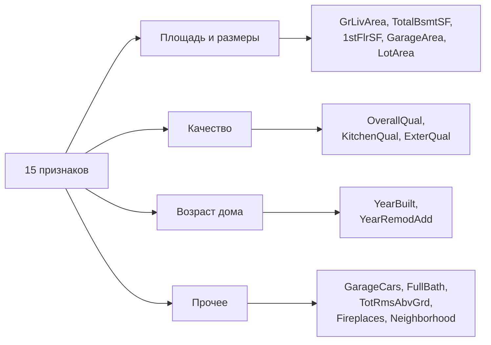
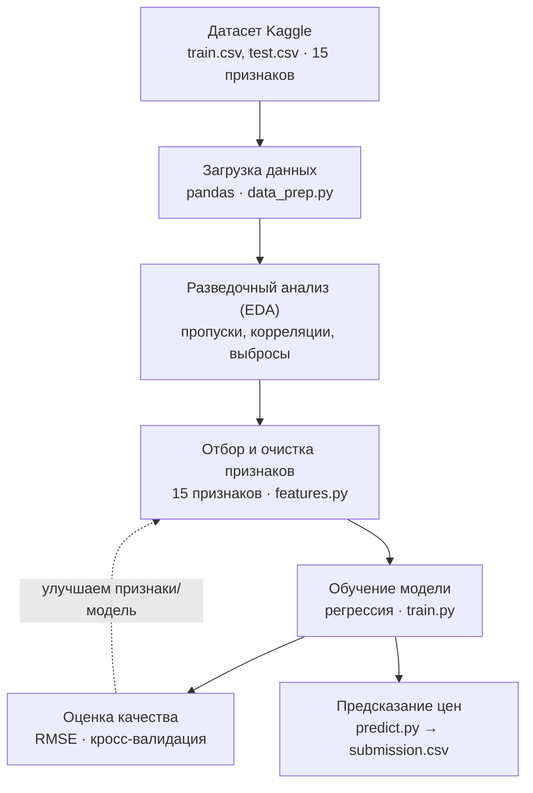
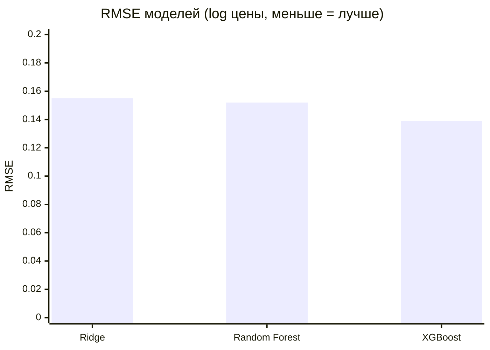

# House Prices - прогноз стоимости домов

Проект по машинному обучению: по характеристикам дома модель предсказывает
цену продажи. Данные взяты с Kaggle -
[Housing Prices Competition](https://www.kaggle.com/competitions/home-data-for-ml-course/data).

## Задача

Задача регрессии: на вход подаются признаки дома (площадь, год постройки,
район, качество отделки и т.д.), на выходе - цена `SalePrice` в долларах.

Качество модели в соревновании оценивается метрикой RMSE по логарифму цены:
`RMSE(log(prediction), log(actual))`. Логарифм нужен, чтобы ошибки на дорогих
и дешёвых домах весили одинаково.

## Данные

Используется датасет Ames Housing - продажи жилых домов в городе Эймс,
штат Айова, за 2006-2010 годы.

- `train.csv` - обучающая выборка, 1460 домов, 15 признаков + цена `SalePrice`
- `test.csv` - тестовая выборка, 1459 домов, те же признаки без цены
- `data_description.txt` - описание всех признаков
- `sample_submission.csv` - пример файла с ответами

Целевая переменная - `SalePrice` (цена продажи).

## Отбор признаков

Для модели мы используем **15 признаков**, которые сильнее всего связаны
с ценой (видно по корреляциям в ноутбуке EDA). Они дают понятную и простую
для объяснения модель.

Отобранные признаки: `OverallQual`, `GrLivArea`, `GarageCars`, `GarageArea`,
`TotalBsmtSF`, `1stFlrSF`, `FullBath`, `TotRmsAbvGrd`, `YearBuilt`,
`YearRemodAdd`, `Fireplaces`, `LotArea`, `Neighborhood`, `KitchenQual`,
`ExterQual`. Список задаётся в `src/data_prep.py` (`SELECTED_FEATURES`).

Эти 15 признаков можно разбить на смысловые группы:



## Архитектура

Данные проходят путь от исходного CSV-файла до готового предсказания цены.
Каждый этап соответствует своему файлу в `src/`.



> Схема также доступна картинкой: [`docs/architecture.svg`](docs/architecture.svg).

## Результаты

Сравнили три модели по трём метрикам на кросс-валидации.
Лучшей оказалась XGBoost.



Метрики (кросс-валидация по 5 фолдам, цена в логарифме):

| Модель | RMSE | MAE | R² |
|---|---|---|---|
| Ridge (линейная) | 0.155 | 0.105 | 0.845 |
| Random Forest | 0.152 | 0.103 | 0.855 |
| **XGBoost** | **0.139** | **0.096** | **0.879** |

RMSE и MAE - средняя ошибка (меньше = лучше), R2 - доля объяснённой
дисперсии от 0 до 1 (больше = лучше). XGBoost лучший по всем трём.

## Структура проекта

```
house-prices-ml/
├── data/
│   ├── raw/            # исходные CSV с Kaggle (в git не хранятся)
│   └── processed/      # обработанные данные
├── notebooks/
│   ├── 01_eda.ipynb    # разведочный анализ
│   └── 02_modeling.ipynb
├── src/
│   ├── data_prep.py    # загрузка, очистка, список 15 признаков
│   ├── features.py     # признаки и препроцессинг
│   ├── train.py        # обучение
│   └── predict.py      # предсказание -> submission.csv
├── docs/
│   └── architecture.svg  # схема архитектуры
├── models/             # сохранённые модели
├── submissions/        # ответы для Kaggle
├── requirements.txt
└── README.md
```

## Запуск

```bash
git clone https://github.com/USERNAME/house-prices-ml.git
cd house-prices-ml

python -m venv venv
source venv/bin/activate        # Windows: venv\Scripts\activate
pip install -r requirements.txt

# скачать данные с Kaggle и положить в data/raw/ (или home-data-for-ml-course/)
python src/train.py             # обучение
python src/predict.py           # предсказание -> submissions/submission.csv
```

## План работы

1. EDA - распределения, пропуски, выбросы, корреляции с ценой
2. Препроцессинг - заполнение пропусков, кодирование категорий, масштабирование
3. Отбор 15 признаков, сильнее всего связанных с ценой
4. Модели - линейная регрессия как базовая, затем Random Forest и градиентный бустинг
5. Валидация - кросс-валидация, RMSE на логарифме цены
6. Submission - собрать `submission.csv` и отправить на Kaggle

## Команда

Над проектом работают два человека.

- Участник 1 - EDA, препроцессинг, признаки (`src/data_prep.py`, `src/features.py`)
- Участник 2 - обучение моделей, валидация, submission (`src/train.py`, `src/predict.py`)

Работаем через ветки: каждый делает свою ветку под задачу и вливает изменения
в `main` через Pull Request.

## Стек

Python, pandas, numpy, scikit-learn, xgboost, matplotlib, seaborn, Jupyter.
